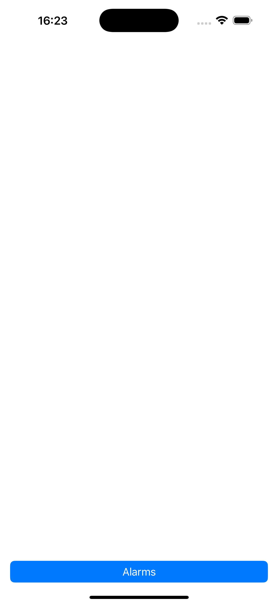
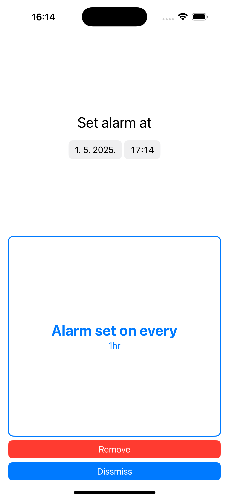
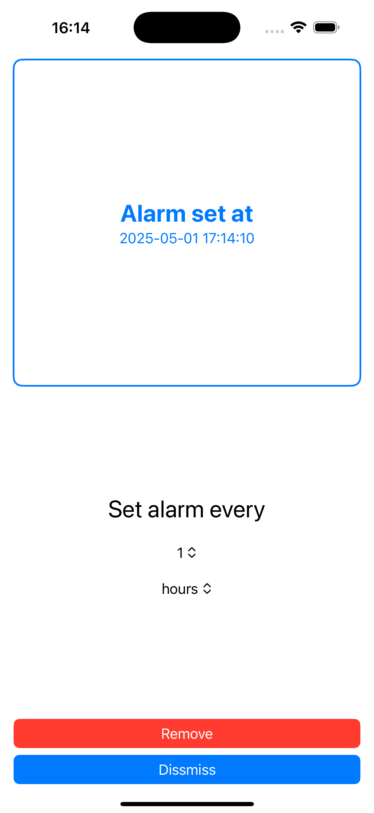
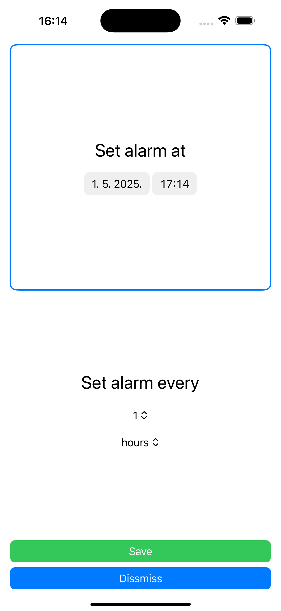

# SwiftUI Combine example

This is example iOS app to play with SwiftUI, Combine framework and reactive programming in general.

It can set alarms (at exact time or every time period defined) to show local notification.

Idea:

- extend to use remote notifications
- use real data for air quality or weather alarms

## Screenshots

   

